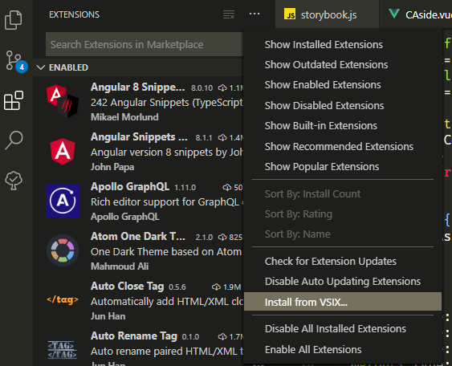

# infra snippets for Visual Studio Code

## How to package extension

1.first install vsce

```code
npm install -g vsce
```

2.run vsce package command

```code
vsce package
```

this command will package the extension into a '\*.vsix' file to the current directory

## Install the extension

choose **Install from 'VSIX...'** command in the extensions page and go to the directory where you put the pachaged extension


